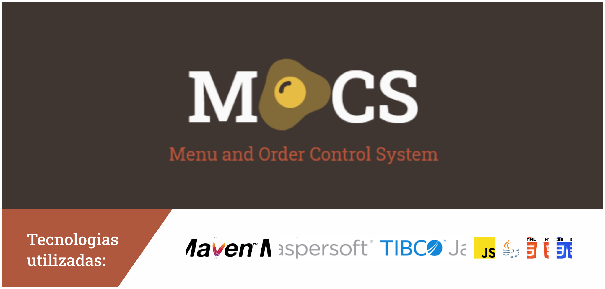

[](https://mocs.euaaron.codes/)

## Index
1. [Preview](#preview)
2. [Sobre](#sobre)
3. [Níveis de Permissão](#níveis-de-permissão)
4. [Como usar o projeto](#como-usar-o-projeto)
5. [Como contribuir](#como-contribuir)
6. [Colaboradores](#colaboradores)

## Preview

A versão mais recente deste projeto está disponível para testes em [mocs.euaaron.codes](https://mocs.euaaron.codes).

## Sobre

MOCS, ou Menu and Order Control System, como o próprio nome diz é um sistema para controlar pedidos e exibir cardápios.

O sistema permirá que usuários cadastrados pesquisem estabelecimentos e vejam os pratos disponíveis. 

Todo usuário pode cadastrar um estabelecimento e vincular usuários à este estabelecimento como funcionários. 

O usuário que cadastra um estabelecimento, automáticamente é adicionado à lista de funcionários, com o nível de permissão 0 (nível dado à funcionários com cargos administrativos máximo).

> MOCS foi inicialmente desenvolvido para a disciplina de LPII (**Linguagem de Programação 2**) em 2019. Apesar d**o foco da disciplina ser o back-end**, seu front-end foi inicialmente desenvolvido como trabalho da disciplina de Desenvolvimento Web. Em 2020, durante a disciplina de LPIII recriamos o projeto utilizando adotando o Maven e ~~descartamos a utilização do **Bootstrap 4.0**~~. A [versão antiga pode ser encontrada aqui](https://github.com/euaaron/MOCS).

## Níveis de Permissão

### Nível 5 - Profissioal de RH
- pode adicionar, alterar ou remover funcionários;

### Nível 4 - Cheff
- pode listar, adicionar, alterar e remover pratos;
- pode listar comandas e pedidos;

### Nível 3 - Garçom
- pode listar, adicionar e remover comandas;
- pode listar, adicionar e remover pedidos de comandas;

### Nível 2 - Supervisor
- todas as permissões do nível 3;
- pode alterar pratos;
- pode alterar comandas;
- pode alterar pedidos de comandas;

### Nível 1 - Gerente Geral 
- todas as permissões anteriores;
- pode adicionar, alterar ou remover funcionários;

### Nível 0 - Administrador 
- todas as permissões anteriores;
- pode adicionar funcionários com nível de permissão 0;
- pode alterar e deletar o estabelecimentos do sistema.

## Como usar o projeto?

1. Clone o projeto como preferir, por exemplo:

```sh
git clone https://github.com/euaaron/mocs-maven.git
```

2. Abra o projeto em sua IDE java preferida, recomendo o **Netbeans 12.1** por não precisar de muitas configurações iniciais.

3. Tenha o Tomcat instaldo, o programa não funciona com o Glassfish.
> Se tiver dificuldades para instalar o Tomcat, instale-o através do Netbeans 8 e copie as configurações escritas em `tools`->`servers`->`Tomcat`. **Atenção: Esta ação é requerida pois o programa não vai abrir no Netbeans 8.**

4. Instale as dependências:
- pelo Netbeans, clique botão direito no projeto e `Resolve project problems`;
- ou pelo maven no terminal, digite `mvn install` ou `mvnw install`.

5. Construa o executável do projeto (ex.: mocs-1.0.0.war)
- basta clicar em build no Netbeans;
- ou pelo maven no terminal, digite `mvn package` ou `mvnw package`.

6. Executar
- no netbenas basta clicar em `run` ou `debug`;
- ou no terminal (com o maven), na pasta raiz do projeto digite:
```sh
java $JAVA_OPTS -jar target/dependency/webapp-runner.jar --port 80 target/*.war
```

## Como contribuir?

- Para dúvidas ou sugestões, [deixe um issue](https://github.com/euaaron/mocs-maven/issues/new/choose).
- Quer codar com a gente? Faça um fork, adicione seu código. - Ah! Pelo menos no momento do merge, faça um [commit semântico](https://gist.github.com/eltonea/a717e3c786686b674f4ebe2475ca3313) e comente quais melhorias que você adicionou.

> Este é um projeto acadêmico, não tenha medo de falhar ou de não saber. Colabore para treinar e evoluir com seus erros!

## Colaboradores

<a href="https://github.com/euaaron" title="@euaaron - Aaron  Stiebler"></a>
<a href="https://github.com/deboralili" title="@deboralili - Debora Lessa"></a>
